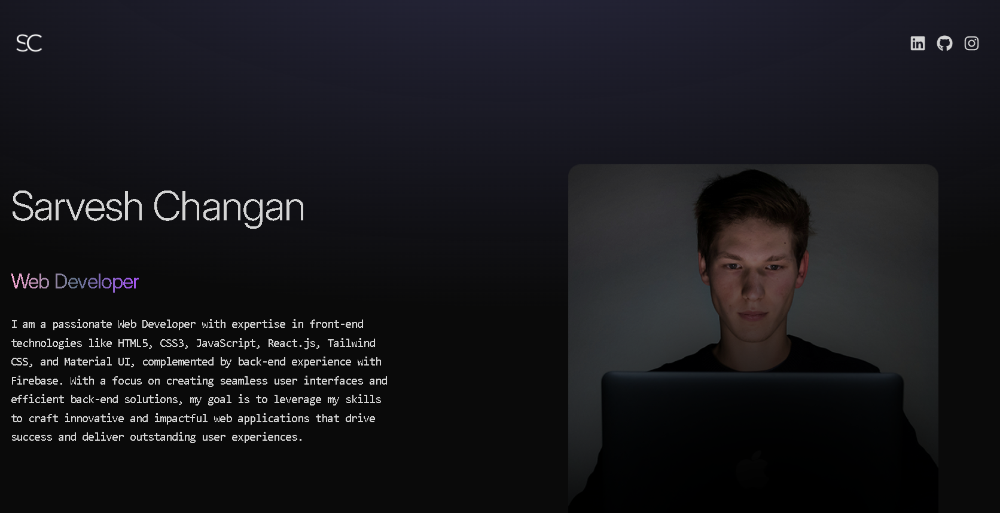

## Portfolio

This portfolio is a cutting-edge web application built with React.js, Framer Motion, and Tailwind CSS. It showcases my projects and skills with a focus on smooth animations and responsive design, offering a modern, interactive user experience.

## Image 

<a href='https://portfilo-blue.vercel.app'></a>

## Live Demo

<a href='https://portfilo-blue.vercel.app'>View Live</a>

## Features

- **Engaging Animations**: Framer Motion adds fluid and engaging transitions, enhancing the overall user experience.
- **Responsive Design**: Tailwind CSS ensures a clean, modern, and mobile-friendly interface that adapts seamlessly to any device.
- **Project Showcase**: Highlights a range of projects with detailed descriptions and interactive elements to demonstrate skills and expertise.

## Tech Stack

- **React**: Utilized for building dynamic and interactive user interfaces.
- **Framer Motion**: Provides smooth animations and transitions to enhance user engagement.
- **Tailwind CSS**: A utility-first CSS framework for efficient styling and responsive design.

## Installation

1. Clone the repository:
    ```bash
    git clone https://github.com/your-username/portfolio.git
    cd portfolio
    ```

2. Install dependencies:
    ```bash
    npm install
    ```

3. Start the development server:
    ```bash
    npm start
    ```

## Usage

- **Project Gallery**: Browse through a curated selection of projects with detailed information and interactive features.
- **Smooth Navigation**: Enjoy a seamless experience with animated transitions and responsive design.
- **Contact Information**: Find ways to connect and collaborate, showcased prominently for easy access.

## Contributing

Contributions are encouraged! Feel free to submit a Pull Request.

## Contact

For any questions or feedback, please reach out to [your-email@example.com](mailto:changansarvesh0@gmial.com).
